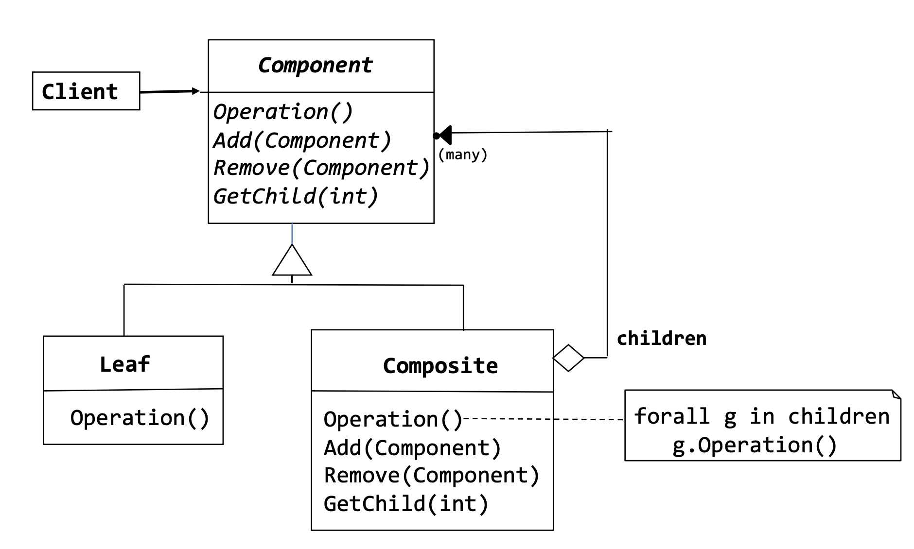
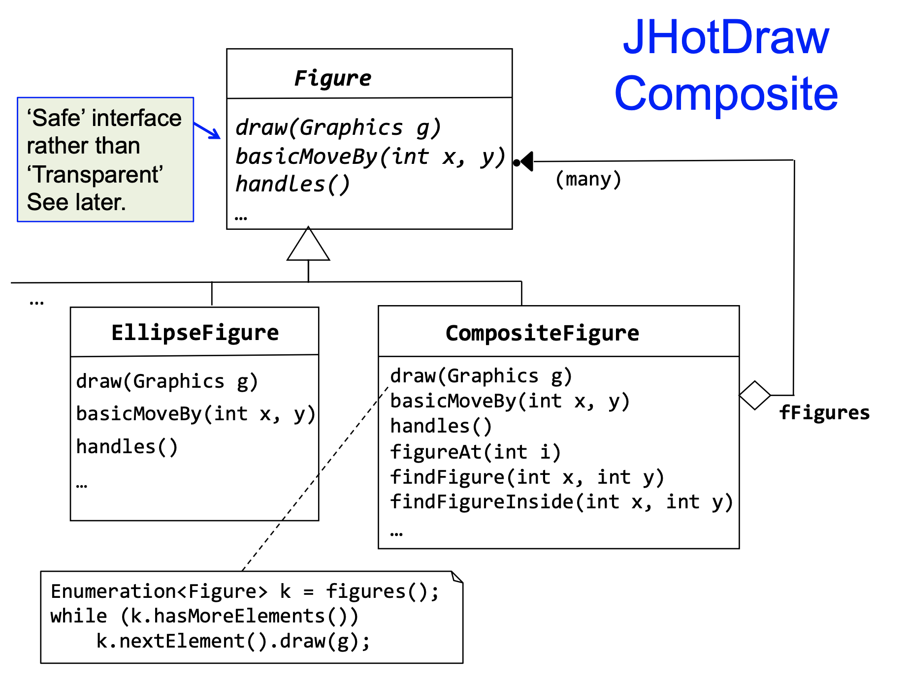

# Composite Design Pattern

Structural Pattern

## Intent

- Compose objects into tree structures to represent part-whole hierarchies.
- Allow clients to treat individual objects and compositions of objects uniformly.
- Define a class hierarchy consisting of primitive objects and composite objects.
- Enable clients to perform operations on individual objects and compositions of objects uniformly.

## Class Diagram


The primary components of the Composite Design Pattern are:

- **Component (Vehicle):** Declares the interface for objects in the composition and implements default behavior for all objects. It can be either an interface or an abstract class.

- **Leaf (ElectricCar, Bike):** Represents the individual objects that do not have any child objects. They implement the Component interface.

- **Composite (CompositeVehicle):** Represents the composite objects that can have child objects (either Leaf or other Composite objects). It implements methods to manipulate child components and defines behavior for its child components.

- **Client:** - Manipulates objects in the composition through the Component interface.

## JHD Examples
- **CompositeFigure:** figure that is composed of several figures. Doesn't define any layout behaviour.  It is up to subclassers to arrange the contained figures. CompositeFigure enables clients to treat a composition of figures like a single figure



## Consequences:
### Positives:
- defines class hierarchies consisting of primitive and composite objects
- simplifies client because the client doesn't have to know if it's dealing with composite of individual object
- can make it easier to add new kinds of components (composites or leafs)
### Negatives:
- making it easy to add new components makes it harder to restrict the components of a composite
- Can’t then rely on type system to enforce such constraints. Need run-time checks

## Implementation Issues
- explicit parent references 
- could cause conflicts with other design principle if many leafs and composites override default implementations
- manage sequencing of children using iterators (if important)

## Transparency vs Safety
  - Declaration of child management operation (add, remove etc...) in Component
    - operations declared in the component interface provides uniform interface for Leafs and Composites
    - makes it indistinguishable for client whether interacting with Leaf of Composite
    - compromises safety because not all components (specifically leaves) can meaningfully implement these operations 
    - Leaves may not support adding or removing child components, leading to potential runtime errors
  - Declaration in Composite
    - Provides safety by restricting operations to only those components capable of handling them (Composite Objects)
    - Prevents inappropriate operations on Leaf nodes
    - creates discrepancy in the interface between Leaf and Composite objects 

###Safe Approach Code example:

```java
// Component interface representing both Leaf and Composite objects
public interface Component {
    void operation();
}

// Leaf class representing individual objects
public class Leaf implements Component {
    @Override
    public void operation() {
        System.out.println("Leaf operation");
        // Leaf-specific operation implementation
    }
}

// Composite class representing composite objects
public class Composite implements Component {
    private List<Component> children = new ArrayList<>();

    @Override
    public void operation() {
        System.out.println("Composite operation");
        // Composite-specific operation implementation
        for (Component child : children) {
            child.operation();
        }
    }

    public void addComponent(Component component) {
        children.add(component);
    }

    public void removeComponent(Component component) {
        children.remove(component);
    }
}

```

###Transparent Approach Example:
```java
// Component interface representing both Leaf and Composite objects
public interface Component {
    void operation();
    void addComponent(Component component); // Child management operation
    void removeComponent(Component component); // Child management operation
    default Component getComposite() { return null; } // Returns null for Leaf
}

// Leaf class representing individual objects
public class Leaf implements Component {
    @Override
    public void operation() {
        System.out.println("Leaf operation");
        // Leaf-specific operation implementation
    }
}

// Composite class representing composite objects
public class Composite implements Component {
    private List<Component> children = new ArrayList<>();

    @Override
    public void operation() {
        System.out.println("Composite operation");
        // Composite-specific operation implementation
        for (Component child : children) {
            child.operation();
        }
    }

    @Override
    public void addComponent(Component component) {
        children.add(component);
    }

    @Override
    public void removeComponent(Component component) {
        children.remove(component);
    }

    @Override
    public Component getComposite() {
        return this; // Returns the reference to itself for Composite objects
    }
}

```