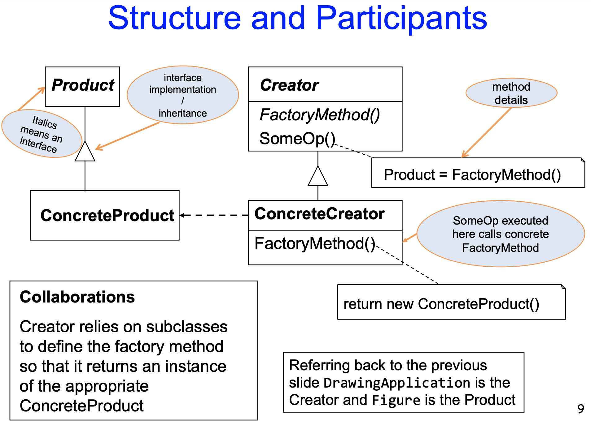

# Factory Design Pattern

Creational Pattern

### Intent
- define an interface for creating an object
- let subclasses decide which class to instantiate 
### Motivation
- application uses number of different types of objects
- knows when to create an object but not what specific type to create (only knows interfaces)

**Use when:** class can't anticipate specific type of object to create

## Class Diagram

- **Product:** Vehicle
- **ConcreteProduct:** Car, Bike
- **Creator:** VehicleFactory
- **ConcreteCreator:** CarFactory, BikeFactory

## JHD Examples
- factory method often used in conjunction with Program to an Interface
  - create the concrete object that implements the interface
- Creating the **Drawing** in **DrawingApplication**
  - Drawing is the Product
  - createDrawing() is the factory method

- Creating **Handles** in **Figure**
  - Connector is the Product
  - connectorAt() is the factory method
- Creating **Figures** in **CreationTool**
- Creating different tools for dragging shapes, dragging handles, and dragging an ‘area tracker’ within **SelectionTool**

## Consequences
### Positives:
- eliminates need to bind application specific classes into code
- provides hooks for subclasses 
- in parallel class hierarchies (Figure types and figure manipulator classes) defines connection between which classes belong together
### Negatives:
- clients might have to subclass the Creator class just to create a particular ConcreteProduct object
- Creator might be abstract and not provide implementation of Factory method
  - implementation has to be defined in subclasses
  - example: Figure and connectorAt()

## Other:
Parameterised Factory Methods 
- allows the creation of multiple kinds of products.
– Parameter identifies the particular kind of object, but all objects will conform to the Product interface
– E.g. if (parameter == X) then return concrete object Y
