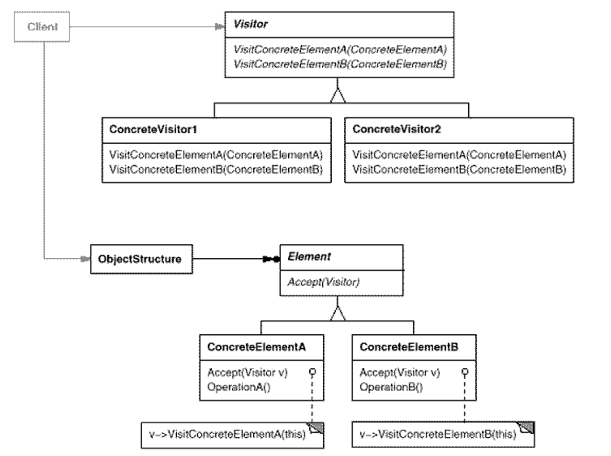

# Visitor Design Pattern

Behavioural Pattern

### Intent
- separate algorithms from objects on which they operate
- define a new operation without changing classes of the elements on which it operates
### Motivation
- Consider a compiler performing operations on elements of an abstract syntax tree (AST)
- classes might become cluttered with operations that might be unrelated

### Description
- package related operations in visitor object
- as AST traversed, pass it to elements
- when element "accepts" visitor, it sends a request to visitor that encodes the element's class including the element as an argument
- visitor can then execute operation on passed element
- Allows you to add new functionality by simply adding new Visitor subclasses

## Class Diagram

- **Visitor:** Visitor
- **ConcreteVisitor1:** FirstVisitor
- **Element:** Shape
- **ConcreteElements:** Circle, Rectangle

## Use When
- need to perform operation on all elements of complex object structure
- clean up the business logic of auxiliary behaviors
- when a behavior makes sense only in some classes of a class hierarchy, but not in others --> extract into separate visitor and implement only those visiting methods that accept objects of relevant classes

## Pros and Cons
### Pros
- open/closed principle
- single responsibility 
### Cons
- need to update all visitors each time class gets added or removed from hierarchy 
- visitors might lack necessary access to private fields and methods